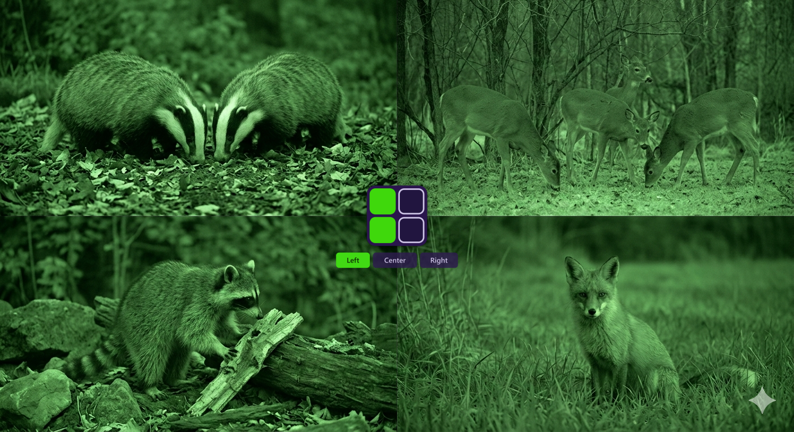
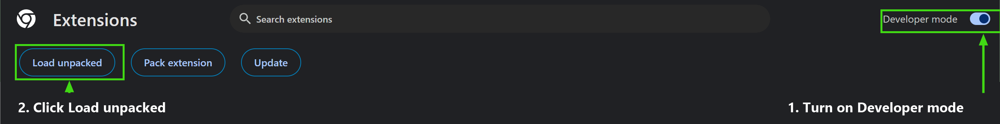
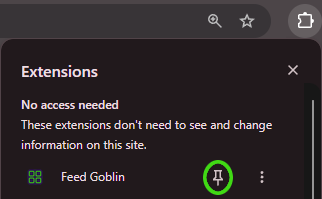

# Feed Goblin

**A friendlier way to watch the Big Brother Live Feeds.**
Jump between cameras with a keypress, pick which camera you hear on the multi-view, and auto-recover when a feed drops.

[**▶ Try the live demo**](https://jakchagu.github.io/feed-goblin/control-demo.html) — no install needed

> **Unofficial fan tool** — not affiliated with or endorsed by Paramount+, CBS, or Big Brother. Needs your own active Paramount+ subscription. It only restyles the player on a page you already have access to — no unlocking, downloading, re-streaming, recording, or data collection — and may conflict with Paramount+'s Terms of Service, so use at your own risk. Because it's unofficial, please don't contact Paramount+ support about it — if the site is misbehaving, turn Feed Goblin off first. MIT-licensed, as-is.

---

  
   
  <em>Demo composite — AI-generated imagery.</em>

## ✨ Features

- **Camera hotkeys** — `1`–`4` jump straight to each camera, `5` to the multi-view.
- **Audio channel select (multi-view)** — the quad packs different cameras into the left/right stereo channels. Hear just one side, or both:
  - `Q` = left, `W` = center (normal), `E` = right
  - or use the on-screen **grid control** — the lit cells show which side currently has sound; hover to expand it and click **Left / Center / Right**. It scales with the window and stays out of the way.
  - Your choice is remembered across reloads and camera switches.
- **Auto-recovery** — if a feed shows an error card (`error code: 3005`, `3304`, etc.) or silently freezes, it reloads the page to get it going again, with backoff so a dead stream doesn't loop forever.
- **Stays unmuted** — remembers your mute state so switching cameras doesn't silence you every time.

<strong>Remote-control API</strong> — optional, for power users

 

Drive audio L/C/R, fullscreen, and jump-to-Big-Brother from any HTTP client (a Stream Deck, Home Assistant, a script) while another window (e.g. a game) is focused. Off by default; runs through a loopback-only local bridge. Setup in [bridge/README.md](bridge/README.md).

---

## 🧩 Install

Feed Goblin isn't on the Chrome Web Store, so you load it manually. This repository (`github.com/jakchagu/feed-goblin`) is the only place I've uploaded it.

1. **[Download ZIP](https://github.com/jakchagu/feed-goblin/archive/refs/heads/main.zip)**.
2. Right-click the downloaded ZIP → **Extract All...**
3. Click **Extract**.
4. Open `chrome://extensions` (or `edge://extensions`).

  

5. Turn on **Developer mode** (top-right).
6. Click **Load unpacked**.
7. Navigate to the folder you extracted/unzipped.
8. Select the extracted/unzipped folder.
9. Click the **Select Folder** button.
10. Pin the extension (puzzle-piece icon → pin).

  

    

**Updating later:** download the latest files, then click the **reload ↻** icon on Feed Goblin's card in `chrome://extensions`.

---

## ▶️ How to use

1. Click the Feed Goblin icon and press **Open Live Feed**. That opens the Big Brother show page, where the extension learns the current camera links (they change each season — this keeps the hotkeys working with no manual setup).
2. Start any camera, or the multi-view.
3. Use the hotkeys:

   | Key | Action |
   |-----|--------|
   | `1`–`4` | Switch to camera 1–4 |
   | `5` | Multi-view (quad) |
   | `Q` / `W` / `E` | Audio: left / center / right *(multi-view)* |
   | `F` | Fullscreen |

The popup also has an **Enabled** toggle to switch everything off without removing the extension.

---

## 🎨 Customizing the look

Change the on-screen control's colors and size (optional, no code editing)

 

The control's colors and size come from a `config.json` file:

1. In the extension's folder (the one you picked in **Load unpacked**), copy **`config.example.json`** to **`config.json`** in the same folder.
2. Edit `config.json` — every key is optional; omit one to keep the built-in default:

   | Key | Sets |
   |-----|------|
   | `scale` | Size of the control (`1` = default, `1.5` = 50% bigger). |
   | `colors.frame` | The control's outer frame. |
   | `colors.cellOff` / `colors.cellStroke` | Unlit cell fill / outline. |
   | `colors.active` | The lit "this side has sound" color. |
   | `colors.activeText` | Text on the active label. |
   | `colors.labelText` / `colors.labelBg` | Hover-label text / background. |

3. In the popup, open **Advanced** → turn on **Custom config**. Toggle it off/on to re-apply after later edits.

`config.json` is gitignored, so updating the extension never overwrites your customizations.

---

## ⚠️ Notes &amp; limits

- **Open the show page once per session** (the "Open Live Feed" button does this) so the extension can cache the current camera links. If hotkeys `1`–`5` don't switch cameras, that cache is missing — go through the show page again.
- **Audio select** only does something on the **multi-view**, since that's the only feed that splits cameras across the stereo channels. On a single camera it just isolates that camera's own left/right.
- **Browser support:** Chrome and Edge (Manifest V3). Firefox isn't currently supported.
- If a feed is genuinely down site-wide, auto-reload can't fix it — it gives up after a few tries and leaves the page so you can retry manually.

---

## 📄 License

MIT — do whatever you like. Provided as-is, with no warranty. See [LICENSE](LICENSE).
